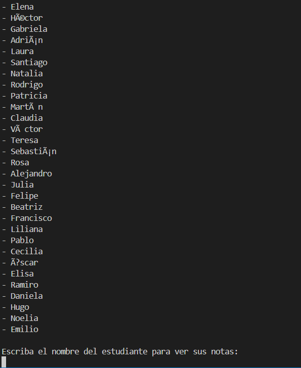
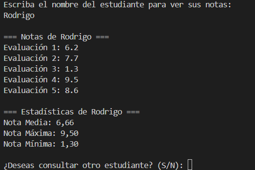

Esta aplicación esta echa con el fin de facilitar todo lo posible el acceso a las notas de los alumnos.
Ya que con tener un fichero con los nombre y notas, somos capaces de con unos subprocesos calcular las notas media, la nota mas baja y nota mas alta para informarnos sobre el alumnado.